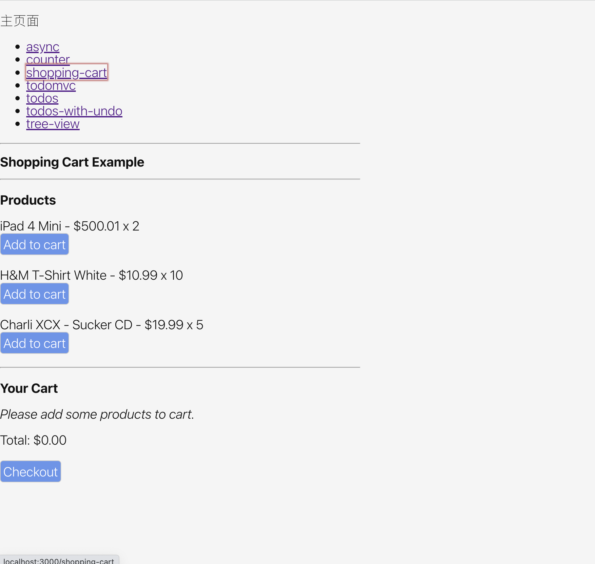

# redux-source-analysis
redux、react-redux及相关中间件源码分析

## packages

- [redux](./src/packages/redux/src)
- [react-redux](./src/packages/react-redux/src)
- [redux-logger](./src/packages/redux-logger/src)
- [redux-thunk](./src/packages/redux-thunk/src)
- [redux-undo](./src/packages/redux-undo/src)
- [use-sync-external-store](./src/packages/use-sync-external-store/src)
## examples

- [async](./src/examples/async/index.jsx)
  

- [counter](./src/examples/counter/index.jsx)
  

- [shoppint-cart](./src/examples/shopping-cart/index.jsx)
  

- [todomvc](./src/examples/todomvc/index.jsx)
  

- [todos](./src/examples/todos/index.jsx)
  

- [todos-with-undo](./src/examples/todos-with-undo/index.jsx)
  

- [tree-view](./src/examples/tree-view/index.jsx)
  
  

